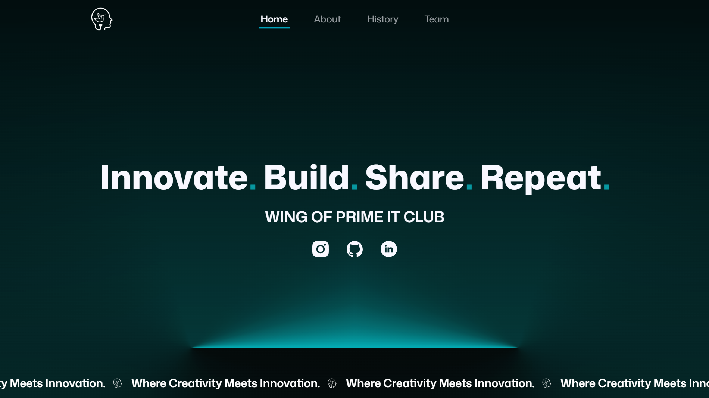

# Mandip Shrestha — Developer Portfolio

A minimal, high-performance portfolio highlighting backend system architecture, API design, and full-stack development capabilities. Built with React, TypeScript, and Tailwind CSS.



## 🚀 Overview

This repository houses the source code for my personal portfolio. It is designed to be:
- **Fast & Lightweight:** Minimal component architecture with strict semantic HTML.
- **Backend-Focused:** Tailored to highlight server-side engineering, database architecture, and complex logic integration.
- **Aesthetically Precise:** Built with a strict dark-mode color palette, Vercel-inspired minimalism, and fluid typography.

## 🧰 Tech Stack

- **Core Technologies:** Node.js, Express.js, React, TypeScript
- **Databases:** MongoDB, PostgreSQL, MySQL
- **Styling:** Tailwind CSS (Strict Utility Approach)
- **Deployment:** Vercel

## 📂 Local Development

To run this portfolio locally:

```bash
# Clone the repository
git clone https://github.com/Mandipstha-17/portfolio.git

# Navigate into the directory
cd portfolio

# Install dependencies
npm install

# Start the development server
npm run dev
```

## 📫 Connect

- **GitHub:** [github.com/Mandipstha-17](https://github.com/Mandipstha-17)
- **LinkedIn:** [linkedin.com/mandip-shrestha-](https://www.linkedin.com/in/mandip-shrestha-/)
- **Email:** mandipstha17@gmail.com
